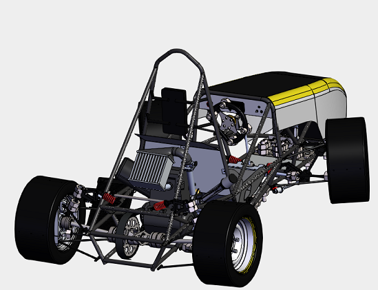

    

#
# Fórmula UTFPR - Vehicule transmission project
This is a project developed for the 2019 FSAE - Brasil competition regulated by [SAE International](https://www.sae.org/). The goal of the competition is to present and phisically test a project of a race vehicule based on the regulation and specifications required by SAE. The cars are developed by teams representing multiple universities and higher education institutions of Brasil. To understand more about the competition please access the official website of the competition [www.fsaeonline.com/](https://www.fsaeonline.com/).

This project competed in the 2019 FSAE - Brasil competition representing the Federal University of Technology – Paraná (UTFPR) with the team FÓRMULA UTFPR. You can find more about the team by its official social media:

- Official website: [keep up with Fórmula UTFPR](http://formulautfpr.com.br/)
- Facebook: [follow Fórmula UTFPR on Facebook](https://www.facebook.com/FormulaUTFPR)
- Instagram: [follow Fórmula UTFPR on Instagram](https://www.instagram.com/formulautfpr/)

This repository contains specifically the part of the project related to the transmission of the vehicule, which I was part of and also leading it.

## Project requirements

The project requirements based on the official documents provided by SAE and functional testing for the vehicule transmission are contained within the following domains:

- Transfer the power and torque efficiently from the engine to the wheels
- Protection for the transmission parts
- Material for protections
- Gometry requirements for protections 
- Choose ideally solutions that improve the mass reduction of the car

## Mapping the characteristics of transmission based on the power and torque delivered by the engine

The main aim of the project was to understand how the power and torque would be transmitted and delivered to the wheels based on the engine characteristics. The engine used in the project was a Yamaha YZF-R3. The power and torque diagram:

    

Based on this diagram and the engine rotation range, the project tested differents transmission final ratios to then, obtain the following diagrams: 1) range of velocities sorted by gear of engine; 2) instant acceleration of the car plotted against the instant velocity; 3) force associated with each acceleration and therefore, the load which the transmission components would be facing. 

1.

    

2.

    

3.

    

## Critical parts design

Knowing the maximum load associated with the movement of the car, the size of the sprocket for the final gear ratio, based on the gear ratio chosen, it was possible to design a scheme for the axles of the car and develope a scrutural analysis taking into account the material chosen and the space available in order to optimize the mass reduction.

    

## Final 3D model

After designing the most critical parts, other parts were selected from multiple commercial options. The virtual assembly is represented:

    

## Prototype and competiion

This project challenges the students to be part of a full product developement project, going through requirements of projects, client needs, technical development, financial analysis for project funding, testing and finally production. The final prototype is presentend on the following photo in the 20219 FSAE Brasil Competition in Piracicaba, SP alongside that year's Fórmula UTFPR team. The Fórmula UTFPR team ended the competition in 21st place out of 38 teams, being the team that progressed the most in comparison to the 2018's competition, in which it ended in last place due to multiple points penalties.

    

Other members involved in the project: Marcelo Griebeler, Matheus Jankovski, Felipe Jacomel, Matheus Martins, Laura Bonatti, Mariana Grigoleto, Eric Tokuda, Matheus Percebon, Henrique Dolinski, Kelvin Klingenfuss, Gabriel Batista, André Ceccon, Rafael Ramalho, Rafael Pietsch, Lucas Franco, Lucas Mathias, Ricardo Janssen, Guilherme Bueno, Gabriel Moreli, Henrique Mosson, Murilo Sambulski.

